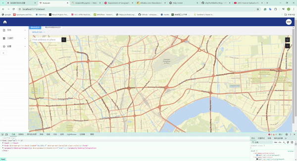

# web_development
The development is still in progress  
Backend:  
Springboot project is back-end directory  
Under the directory use 'java -jar MVC-1.0-SNAPSHOT-execute.jar' to run backend(have to get Redis and database running)  

Frontend:   
Front-end version for Node.js has to be above 18  
Under the directory use 'npm install' and 'npm run dev' to run frontend  

